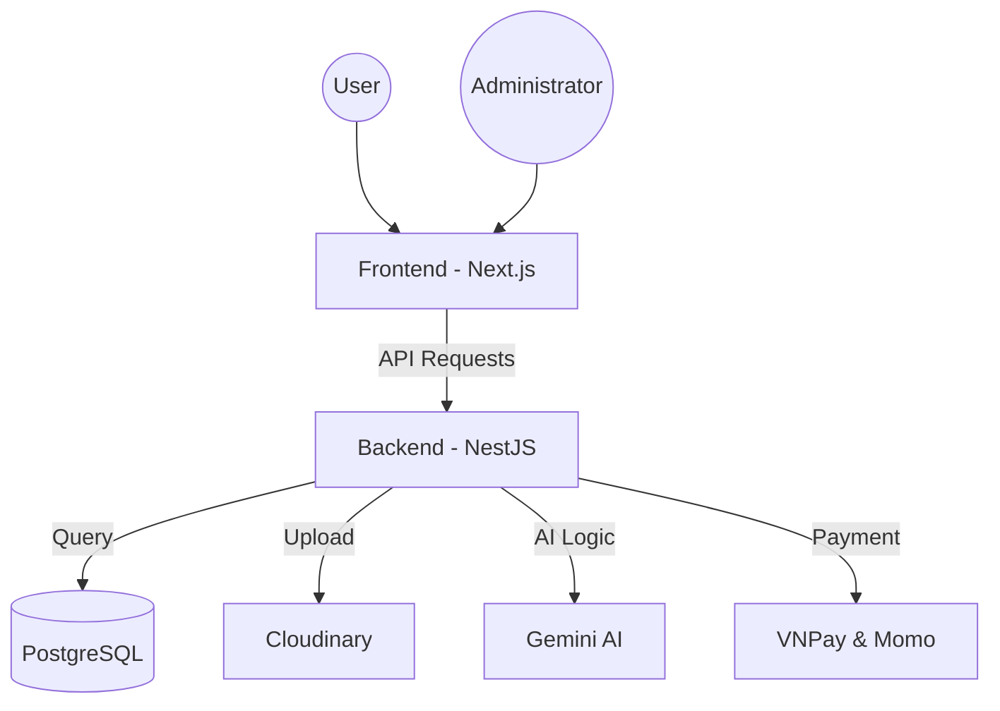

# 📚 DreamBook - Online Bookstore System

[](https://nextjs.org/)
[](https://nestjs.com/)
[](https://www.postgresql.org/)
[](https://tailwindcss.com/)
[](https://deepmind.google/technologies/gemini/)

## 🔗 Live Demo
[](https://book-store-nestjs-nextjs.vercel.app)

DreamBook is an e-commerce platform dedicated to books, built with modern technologies to provide a secure and convenient shopping experience.

---

## ✨ Main Features

### 🤖 AI Assistant (Gemini RAG)
- Integrated chatbot using the **Google Gemini** model.
- Supports book search and recommendations based on user preferences.
- Handles queries regarding book information, authors, and genres.

### 💳 Payments & Transactions
- **VNPay** and **Momo** payment gateway integration.
- Cart and Wishlist management system.
- Automated **PDF** invoice generation.

### 📊 System Administration (Admin Dashboard)
- Administration interface with visual statistics for revenue and orders (**Recharts**).
- Comprehensive management of: Books, Genres, Authors, Users, Orders, and Coupons.
- Role-based Access Control (RBAC) for Admins and Users.

### 🎨 User Experience (UX/UI)
- Responsive interface across multiple devices.
- Interaction effects powered by **Framer Motion**.
- Search and filtering by price, genre, and author.

---

## 🛠 Tech Stack

### Frontend
- **Framework:** Next.js 15+ (App Router)
- **UI/UX:** Tailwind CSS 4.0, Framer Motion, Lucide Icons
- **State Management:** TanStack React Query v5
- **Authentication:** NextAuth.js
- **Data Visualization:** Recharts
- **Utilities:** Axios, Zod, jsPDF, html2canvas

### Backend
- **Framework:** NestJS 11+ (TypeScript)
- **Database:** PostgreSQL
- **ORM:** TypeORM
- **Security:** JWT, Passport, BcryptJS, Throttler
- **AI Integration:** LangChain, Google Generative AI (Gemini Pro)
- **Payment:** VNPay & Momo Integration
- **Storage:** Cloudinary (Image Management)
- **Documentation:** Swagger UI

---

## 📦 Module Structure (Backend)

The system is designed with a modular architecture for scalability:

- **Auth & Users:** Authentication, authorization, and user profiles.
- **Products & Genres:** Inventory management for books, categories, and authors.
- **Orders & Invoices:** Order processing, payments, and invoice generation.
- **AI Service:** RAG (Retrieval-Augmented Generation) integration for the Chatbot.
- **Carts & Wishlists:** Management of shopping interactions.
- **Coupons:** Flexible discount code system.
- **Reviews:** User ratings and feedback.
- **Uploads:** Image handling via Cloudinary.

---

## 🏗 System Architecture



---

## 🚀 Installation Guide

### 1. System Requirements
- **Node.js**: v18.x or later
- **Docker**: (Optional for containerized deployment)
- **PostgreSQL**: Database server

### 2. Backend Setup
```bash
cd be
npm install
# Create .env file and configure environment variables (DB, JWT, Gemini API Key, etc.)
npm run start:dev
```

### 3. Frontend Setup
```bash
cd fe
npm install
# Create .env file and configure (API URL, NextAuth secret, etc.)
npm run dev
```

### 4. Running with Docker
```bash
docker-compose up --build
```

---

## 📑 API Documentation
Once the Backend is running, you can access the API documentation at:
- Swagger UI: `http://localhost:4000/api`

